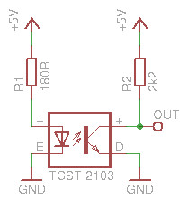

# Энкодер

Для энкодера у меня готовое изделие на основе TCST 2103.
Там 3 провода U,S,G -- +,сигнал,земля. Схема того
что мне досталась похожа на стандартную (ниже), с двумя
отличиями:

- R1 переехал между E и землёй (никакой разницы)
- параллельно R2 через дополнительное сопротивление
  воткнут маленький красный светодид, которой похоже
  светится когда есть сигнал.

Нога S цепляется, очевидно, к аналоговому входу.

## Другие варианты

Другие готовые энкодеры используют другую, пока неопознанную
оптопару и компаратор LM393. Компоратор позволяет использовать
цифровую ногу вместо аналоговой.

https://forum.hobbycomponents.com/viewtopic.php?t=2111

Ещё можно сделать энкодер из двигателя от hdd:
http://omapalvelin.homedns.org/electr/rotary-enc/

Интересная статья про компаратор, дребезг и всё такое:
http://androminarobot-english.blogspot.com/2017/03/encoder-and-arduinotutorial-about-ir.html
